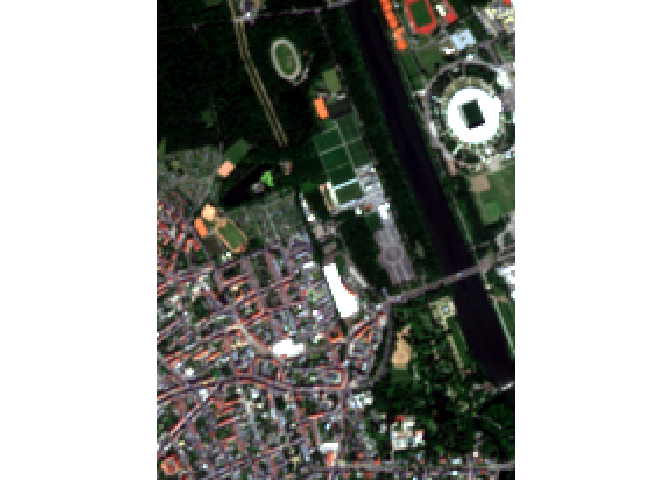
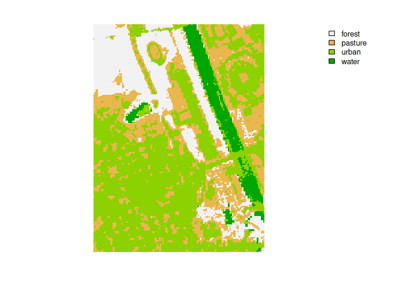

# mlr3spatial

Package website: [release](https://mlr3spatial.mlr-org.com/) |
[dev](https://mlr3spatial.mlr-org.com/dev/)

mlr3spatial is an extension package for spatial objects within the
[mlr3](https://mlr3.mlr-org.com) ecosystem.

## Feature Overview

  - Read training data from [sf](https://CRAN.R-project.org/package=sf)
    objects.
  - Predict on raster objects from the packages
    [terra](https://CRAN.R-project.org/package=terra),
    [raster](https://CRAN.R-project.org/package=raster) and
    [stars](https://CRAN.R-project.org/package=stars).
  - Write model predictions to raster files.
  - Predict large raster objects in parallel.
  - Read raster objects in chunks to avoid memory issues.
  - Built-in toy tasks
    [`leipzig`](https://mlr3spatial.mlr-org.com/dev/reference/leipzig.html).

Check out
[mlr3spatiotempcv](https://github.com/mlr-org/mlr3spatiotempcv) for
spatiotemporal resampling within mlr3.

## Installation

Install the last release from CRAN:

``` r
install.packages("mlr3spatial")
```

Install the development version from GitHub:

``` r
remotes::install_github("mlr-org/mlr3spatial")
```

## Example

``` r
library(mlr3)
library(mlr3spatial)
library(terra, exclude = "resample")
library(sf)

# load sample points
leipzig_vector = read_sf(system.file("extdata", "leipzig_points.gpkg", package = "mlr3spatial"), stringsAsFactors = TRUE)

# create land cover task
task = as_task_classif_st(leipzig_vector, target = "land_cover")
task
```

    ## <TaskClassifST:leipzig_vector> (97 x 9)
    ## * Target: land_cover
    ## * Properties: multiclass
    ## * Features (8):
    ##   - dbl (8): b02, b03, b04, b06, b07, b08, b11, ndvi
    ## * Coordinates:
    ##            X       Y
    ##  1: 732480.1 5693957
    ##  2: 732217.4 5692769
    ##  3: 732737.2 5692469
    ##  4: 733169.3 5692777
    ##  5: 732202.2 5692644
    ## ---                 
    ## 93: 733018.7 5692342
    ## 94: 732551.4 5692887
    ## 95: 732520.4 5692589
    ## 96: 732542.2 5692204
    ## 97: 732437.8 5692300

``` r
# load learner
learner = lrn("classif.rpart")

# train the model
learner$train(task)

# load raster file
leipzig_raster = rast(system.file("extdata", "leipzig_raster.tif", package = "mlr3spatial"))
```

``` r
plotRGB(leipzig_raster, r = 3, g = 2, b = 1)
```



``` r
# create predict task
task_predict = as_task_unsupervised(leipzig_raster)

# predict land cover map
land_cover = predict_spatial(task_predict, learner)
```

``` r
plot(land_cover)
```



## FAQ

<details>

<summary>Will mlr3spatial support spatial learners?</summary> <br>
Eventually. It is not yet clear whether these would live in
mlr3extralearners or in {mlr3spatial}. So far there are none yet.

</details>

<details>

<summary>Why are there two packages, mlr3spatial and
mlr3spatiotempcv?</summary> <br> mlr3spatiotempcv is solely devoted to
resampling techniques. There are quite a few and keeping packages small
is one of the development philosophies of the mlr3 framework. Also back
in the days when mlr3spatiotempcv was developed it was not yet clear how
we want to structure additional spatial components such as prediction
support for spatial classes and so on.

</details>
