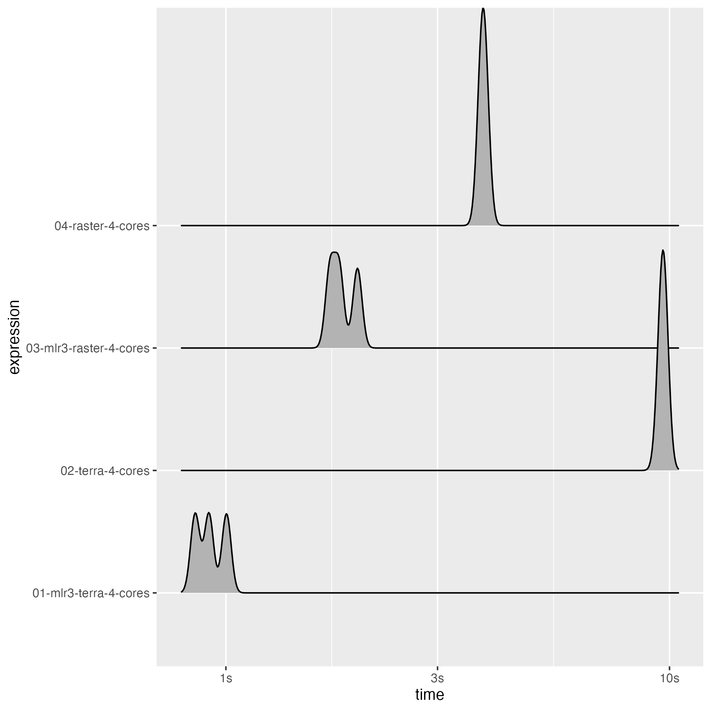
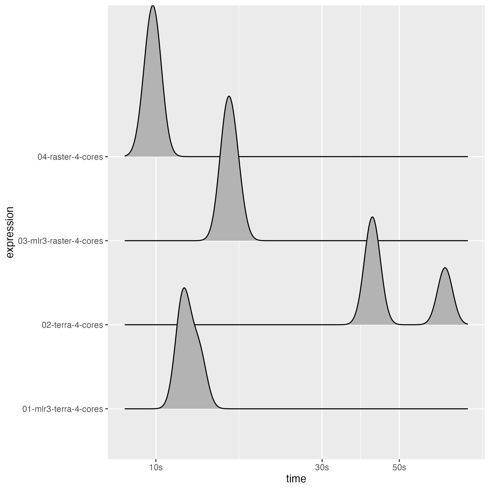

This benchmark was run on a MacBook Pro 2021 (arm64) with the following specs

- M1 Pro
- 32 GB RAM

Note that the differences between the parallel and sequential timings will increase for larger objects as the overhead for starting the parallel workers and collecting the results will decrease.

It is not fully clear why the parallel approach of the {terra} package is slow than its sequential counterpart but it might relate to the single-core performance of the machine the benchmark was run on in combination with the overhead associated with starting the parallel cluster the way it is done in the {terra} package.


```r
library(mlr3)
library(mlr3spatial)
library(future)
library(bench)
library(stars)
#> Loading required package: abind
#> Loading required package: sf
#> Linking to GEOS 3.9.1, GDAL 3.4.2, PROJ 8.2.1; sf_use_s2() is TRUE
library(rpart)
```

## Small files

- ~ 250k values
- 48 MB on disk


```r
# SpatRaster demo stack
stack_terra = demo_stack_spatraster(50)
value = data.table::data.table(ID = c(0, 1), y = c("negative", "positive"))
terra::set.cats(stack_terra, layer = "y", value = value)
colnames = names(stack_terra)
file_terra = tempfile("terra", fileext = ".tif")
terra::writeRaster(stack_terra, file_terra)

# RasterBrick demo stack
stack_raster = demo_stack_rasterbrick(50)
colnames_raster = names(stack_raster)
file_raster = tempfile("raster", fileext = ".tif")
raster::writeRaster(stack_raster, file_raster)
#> Warning in .gd_SetProject(object, ...): NOT UPDATED FOR PROJ >= 6

# tasks
stack_terra = terra::rast(file_terra)
backend_terra = DataBackendRaster$new(stack_terra)
task_terra = as_task_regr(backend_terra, target = "x_1")

stack_raster = raster::brick(file_raster)
names(stack_raster) = colnames_raster
backend_raster = DataBackendRaster$new(stack_raster)
#> Warning in raster::wkt(from): no wkt comment
task_raster = as_task_regr(backend_raster, target = "x_1")

# Train learners
set.seed(42)
row_ids = sample(1:task_terra$nrow, 50)

learner_task_terra = lrn("regr.rpart")
learner_task_terra$parallel_predict = TRUE
learner_task_terra$train(task_terra, row_ids = row_ids)

learner_task_raster = lrn("regr.rpart")
learner_task_terra$parallel_predict = TRUE
learner_task_raster$train(task_raster, row_ids = row_ids)

# non-mlr3 models
rpart_task_terra = rpart::rpart(x_1 ~ ., task_terra$data(rows = row_ids))
rpart_task_raster = rpart::rpart(x_1 ~ ., task_raster$data(rows = row_ids))
```


```r
bm = bench::mark(

  "01-mlr3-terra-4-cores" = {
    plan(multicore, workers = 4)
    predict_spatial(task_terra, learner_task_terra, chunksize = 2000L)
  },

  "02-terra-4-cores" = terra::predict(stack_terra, rpart_task_terra, cores = 4, cpkgs = "rpart"),

  "03-mlr3-raster-4-cores" = {
    plan(multicore, workers = 4)
    predict_spatial(task_raster, learner_task_raster, chunksize = 2000L, format = "raster")
  },

  "04-raster-4-cores" = {
    library(raster)
    library(rpart)
    beginCluster(4, type = "PSOCK")
    clusterR(stack_raster, predict, args = list(model = rpart_task_raster))
  },

  check = FALSE, filter_gc = FALSE, min_iterations = 3,
  max_iterations = 3, memory = FALSE)
#> Loading required package: sp

bm$`itr/sec` = NULL
bm$result = NULL
bm$`gc/sec` = NULL
bm$memory = NULL
bm$mem_alloc = NULL

print(bm)
#> # A tibble: 4 × 8
#>   expression                  min   median n_itr  n_gc total_time time           gc              
#>   <bch:expr>             <bch:tm> <bch:tm> <int> <dbl>   <bch:tm> <list>         <list>          
#> 1 01-mlr3-terra-4-cores  852.65ms 915.91ms     3    22      2.77s <bench_tm [3]> <tibble [3 × 3]>
#> 2 02-terra-4-cores          9.54s     9.7s     3    34        29s <bench_tm [3]> <tibble [3 × 3]>
#> 3 03-mlr3-raster-4-cores    1.72s     1.8s     3    28       5.5s <bench_tm [3]> <tibble [3 × 3]>
#> 4 04-raster-4-cores         3.76s    3.79s     3     1     11.41s <bench_tm [3]> <tibble [3 × 3]>
```


```r
library(ggplot2)
autoplot(bm, type = "ridge")
#> Loading required namespace: tidyr
#> Picking joint bandwidth of 0.0103
```




## Large files

- ~ 25 Mio. values

- 485 MB on disk


```r
# SpatRaster demo stack
stack_terra = demo_stack_spatraster(500)
value = data.table::data.table(ID = c(0, 1), y = c("negative", "positive"))
terra::set.cats(stack_terra, layer = "y", value = value)
colnames = names(stack_terra)
file_terra = tempfile("terra", fileext = ".tif")
terra::writeRaster(stack_terra, file_terra)

# RasterBrick demo stack
stack_raster = demo_stack_rasterbrick(500)
colnames_raster = names(stack_raster)
file_raster = tempfile("raster", fileext = ".tif")
raster::writeRaster(stack_raster, file_raster)
#> Warning in .gd_SetProject(object, ...): NOT UPDATED FOR PROJ >= 6

# tasks
stack_terra = terra::rast(file_terra)
backend_terra = DataBackendRaster$new(stack_terra)
task_terra = as_task_regr(backend_terra, target = "x_1")

stack_raster = raster::brick(file_raster)
names(stack_raster) = colnames_raster
backend_raster = DataBackendRaster$new(stack_raster)
#> Warning in raster::wkt(from): no wkt comment
task_raster = as_task_regr(backend_raster, target = "x_1")

# Train learners
set.seed(42)
row_ids = sample(1:task_terra$nrow, 50)

learner_task_terra = lrn("regr.rpart")
learner_task_terra$parallel_predict = TRUE
learner_task_terra$train(task_terra, row_ids = row_ids)

learner_task_raster = lrn("regr.rpart")
learner_task_terra$parallel_predict = TRUE
learner_task_raster$train(task_raster, row_ids = row_ids)

# non-mlr3 models
rpart_task_terra = rpart::rpart(x_1 ~ ., task_terra$data(rows = row_ids))
rpart_task_raster = rpart::rpart(x_1 ~ ., task_raster$data(rows = row_ids))
```


```r
bm = bench::mark(

  "01-mlr3-terra-4-cores" = {
    plan(multicore, workers = 4)
    predict_spatial(task_terra, learner_task_terra, chunksize = 2000L)
  },

  "02-terra-4-cores" = terra::predict(stack_terra, rpart_task_terra, cores = 4, cpkgs = "rpart"),

  "03-mlr3-raster-4-cores" = {
    plan(multicore, workers = 4)
    predict_spatial(task_raster, learner_task_raster, chunksize = 2000L, format = "raster")
  },

  "04-raster-4-cores" = {
    library(raster)
    library(rpart)
    beginCluster(4, type = "PSOCK")
    clusterR(stack_raster, predict, args = list(model = rpart_task_raster))
  },

  check = FALSE, filter_gc = FALSE, min_iterations = 3,
  max_iterations = 3, memory = FALSE)

bm$`itr/sec` = NULL
bm$result = NULL
bm$`gc/sec` = NULL
bm$memory = NULL
bm$mem_alloc = NULL

print(bm)
#> # A tibble: 4 × 8
#>   expression                  min   median n_itr  n_gc total_time time           gc              
#>   <bch:expr>             <bch:tm> <bch:tm> <int> <dbl>   <bch:tm> <list>         <list>          
#> 1 01-mlr3-terra-4-cores    11.93s   12.01s     3   167     37.23s <bench_tm [3]> <tibble [3 × 3]>
#> 2 02-terra-4-cores         41.14s   42.54s     3    32      2.52m <bench_tm [3]> <tibble [3 × 3]>
#> 3 03-mlr3-raster-4-cores   15.81s   16.09s     3    31     48.85s <bench_tm [3]> <tibble [3 × 3]>
#> 4 04-raster-4-cores         9.46s    9.85s     3     0     29.36s <bench_tm [3]> <tibble [3 × 3]>
```


```r
library(ggplot2)
autoplot(bm, type = "ridge")
#> Picking joint bandwidth of 0.0215
```




