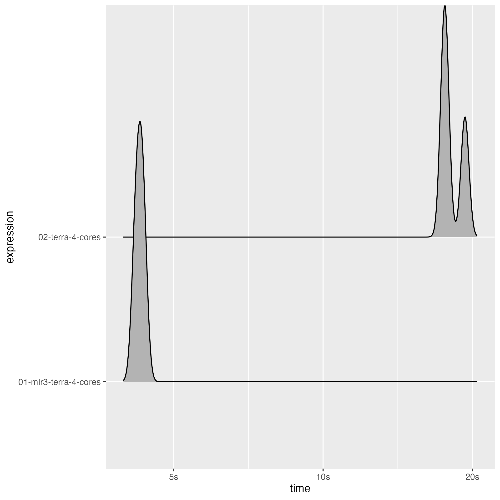
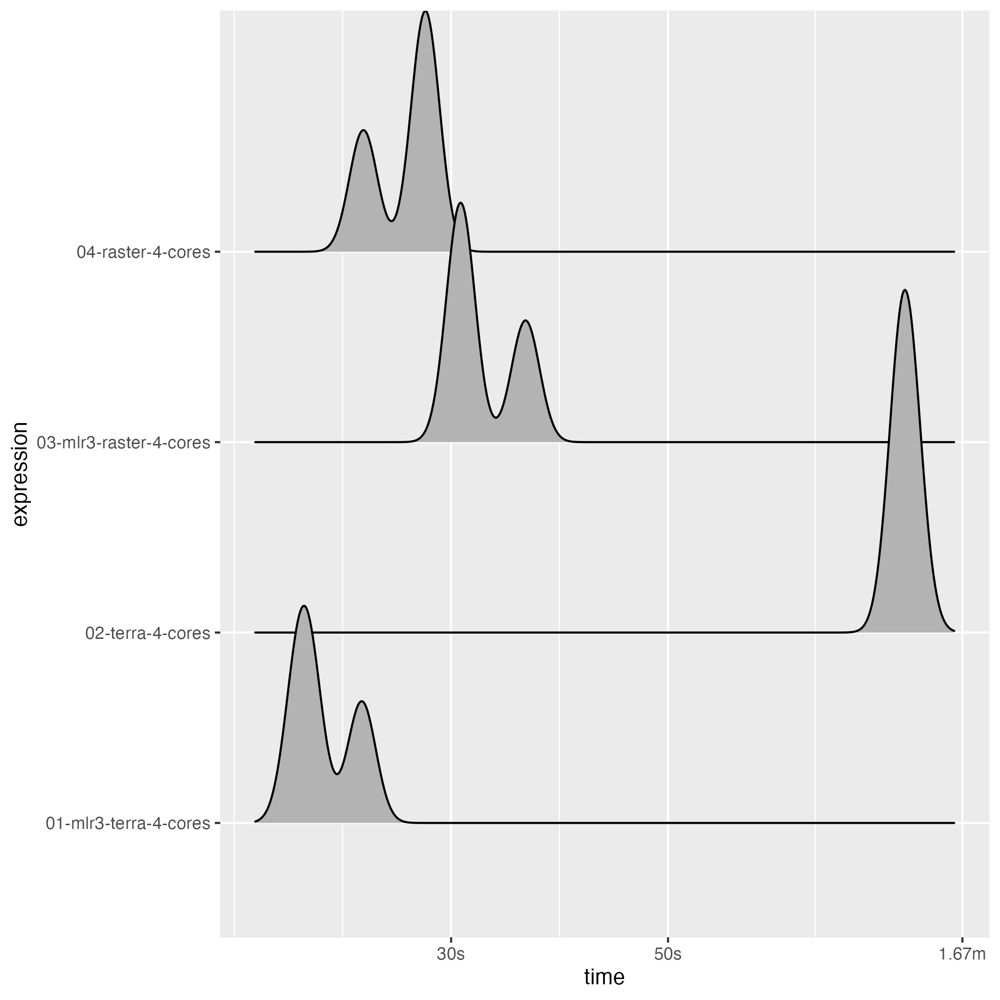

This benchmark was run on a MacBook Pro 2020 with the following specs

- Intel i7-1068NG7 (8) @ 2.30GHz
- 32 GB DDR4 RAM

Note that the differences between the parallel and sequential timings will increase for larger objects as the overhead for starting the parallel workers and collecting the results will decrease.

It is not fully clear why the parallel approach of the {terra} package is slow than its sequential counterpart but it might relate to the single-core performance of the machine the benchmark was run on in combination with the overhead associated with starting the parallel cluster the way it is done in the {terra} package.


```r
library(mlr3)
library(mlr3spatial)
library(future)
library(bench)
library(stars)
library(rpart)
```

## Small files


```r
# SpatRaster demo stack
stack_classif = demo_stack_spatraster(50)
value = data.table::data.table(ID = c(0, 1), y = c("negative", "positive"))
terra::setCats(stack_classif, layer = "y", value = value)
colnames = names(stack_classif)
file = tempfile(fileext = ".tif")
terra::writeRaster(stack_classif, file)

# tasks
stack_classif = terra::rast(file)
backend = DataBackendSpatial$new(stack_classif)
task = as_task_classif(backend, target = "y", positive = "positive")

set.seed(42)
row_ids = sample(1:task$nrow, 50)

learner = lrn("classif.rpart")
learner$train(task, row_ids = row_ids)

# non-mlr3 model
rpart = rpart::rpart(y ~ ., task$data(rows = row_ids))
```


```r
bm = bench::mark(

  "01-mlr3-terra-4-cores" = {
    plan(multicore, workers = 4)
    predict_spatial(task, learner, chunksize = 2000L)
  },

  "02-terra-4-cores" = terra::predict(stack_classif, rpart, cores = 4, cpkgs = "rpart"),

  check = FALSE, filter_gc = FALSE, min_iterations = 3, memory = FALSE)
#> INFO  [22:13:20.889] Start raster prediction 
#> INFO  [22:13:20.895] Prediction is executed with a chunksize of 2000, 1 chunk(s) in total, 2499561 values per chunk 
#> INFO  [22:13:24.983] Chunk 1 of 1 finished 
#> INFO  [22:13:25.063] Finished raster prediction in 4 seconds 
#> INFO  [22:13:25.071] Start raster prediction 
#> INFO  [22:13:25.076] Prediction is executed with a chunksize of 2000, 1 chunk(s) in total, 2499561 values per chunk 
#> INFO  [22:13:29.323] Chunk 1 of 1 finished 
#> INFO  [22:13:29.412] Finished raster prediction in 4 seconds 
#> INFO  [22:13:29.422] Start raster prediction 
#> INFO  [22:13:29.428] Prediction is executed with a chunksize of 2000, 1 chunk(s) in total, 2499561 values per chunk 
#> INFO  [22:13:33.603] Chunk 1 of 1 finished 
#> INFO  [22:13:33.686] Finished raster prediction in 4 seconds

bm$`itr/sec` = NULL
bm$result = NULL
bm$`gc/sec` = NULL
bm$mem_alloc = NULL
bm$memory = NULL

print(bm)
#> # A tibble: 2 × 8
#>   expression                 min   median n_itr  n_gc total_time time           gc              
#>   <bch:expr>            <bch:tm> <bch:tm> <int> <dbl>   <bch:tm> <list>         <list>          
#> 1 01-mlr3-terra-4-cores    4.18s    4.27s     3     2      12.8s <bench_tm [3]> <tibble [3 × 3]>
#> 2 02-terra-4-cores        17.51s   17.68s     3     2      54.5s <bench_tm [3]> <tibble [3 × 3]>
```


```r
library(ggplot2)
autoplot(bm, type = "ridge")
#> Picking joint bandwidth of 0.00802
```




## Large files


```r
# SpatRaster demo stack
stack_classif = demo_stack_spatraster(500)
value = data.table::data.table(ID = c(0, 1), y = c("negative", "positive"))
terra::setCats(stack_classif, layer = "y", value = value)
colnames = names(stack_classif)
file = tempfile(fileext = ".tif")
terra::writeRaster(stack_classif, file)

# tasks
stack_classif = terra::rast(file)
backend = DataBackendSpatial$new(stack_classif)
task = as_task_classif(backend, target = "y", positive = "positive")

set.seed(42)
row_ids = sample(1:task$nrow, 50)

learner = lrn("classif.rpart")
learner$train(task, row_ids = row_ids)

# non-mlr3 model
rpart = rpart::rpart(y ~ ., task$data(rows = row_ids))
```


```r
bm = bench::mark(

  "01-mlr3-terra-4-cores" = {
    plan(multicore, workers = 4)
    predict_spatial(task, learner, chunksize = 2000L)
  },

  "02-terra-4-cores" = terra::predict(stack_classif, rpart, cores = 4, cpkgs = "rpart"),

  check = FALSE, filter_gc = FALSE, min_iterations = 3, memory = FALSE)
#> INFO  [22:14:58.898] Start raster prediction 
#> INFO  [22:14:58.903] Prediction is executed with a chunksize of 2000, 1 chunk(s) in total, 25000000 values per chunk 
#> INFO  [22:15:43.166] Chunk 1 of 1 finished 
#> INFO  [22:15:44.049] Finished raster prediction in 45 seconds 
#> INFO  [22:15:44.058] Start raster prediction 
#> INFO  [22:15:44.064] Prediction is executed with a chunksize of 2000, 1 chunk(s) in total, 25000000 values per chunk 
#> INFO  [22:16:31.095] Chunk 1 of 1 finished 
#> INFO  [22:16:31.912] Finished raster prediction in 47 seconds 
#> INFO  [22:16:31.922] Start raster prediction 
#> INFO  [22:16:31.927] Prediction is executed with a chunksize of 2000, 1 chunk(s) in total, 25000000 values per chunk 
#> INFO  [22:17:19.887] Chunk 1 of 1 finished 
#> INFO  [22:17:20.791] Finished raster prediction in 48 seconds

bm$`itr/sec` = NULL
bm$result = NULL
bm$`gc/sec` = NULL
bm$mem_alloc = NULL
bm$memory = NULL

print(bm)
#> # A tibble: 2 × 8
#>   expression                 min   median n_itr  n_gc total_time time           gc              
#>   <bch:expr>            <bch:tm> <bch:tm> <int> <dbl>   <bch:tm> <list>         <list>          
#> 1 01-mlr3-terra-4-cores   45.16s   47.86s     3    40      2.37m <bench_tm [3]> <tibble [3 × 3]>
#> 2 02-terra-4-cores         1.35m    1.43m     3    20      4.23m <bench_tm [3]> <tibble [3 × 3]>
```


```r
library(ggplot2)
autoplot(bm, type = "ridge")
#> Picking joint bandwidth of 0.009
```




